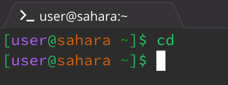
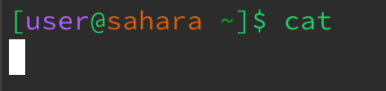

# CSE 15L - Lab 1
Example 1: cd, no argument

Example 2: cd, directory argument

Example 3: cd, file argument

Example 4: ls, no argument

Example 5: ls, directory argument

Example 6: ls, file argument

Example 7: cat, no argument

Example 8: cat, directory argument

Example 9: cat, file argument

