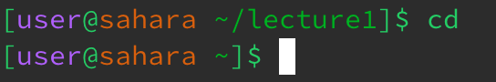
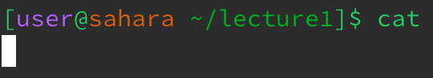
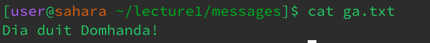

# CSE 15L - Lab 1
Example 1: cd, no argument

I ran the cd command with no argument out of the lecture1 directory. The working directory changed, because running cd with no command returns the implementer to the home directory. There was no error produced by this.

Example 2: cd, directory argument

I ran the cd command with a lecture1 directory argument. The working directory (home) changed to the directory I chose (lecture 1). This occurred because the cd command functions to change the directory. There was no error produced by this.

Example 3: cd, file argument

I ran the cd command out of the lecture1 directory with a file argument. I received a message in the terminal stating that the argument is "Not a directory". The working directory was not changed. This could be considered an invalid argument error as the command is specific to directory arguments and will not work with a file argument.

Example 4: ls, no argument

I ran the ls command out of home directory with no argument. The terminal listed the directories within the home directory (in this case, the only directory was lecture1, and that was all that was listed. This occurred because the ls command functions to list files and directories. There was no error. 

Example 5: ls, directory argument

I ran the ls command with a lecture1 directory argument. The terminal listed the files and directories within the lecture1 directory. This occurred because ls command was assigned to the lecture1 directory and functions to list files and directories within the assigned directory. There was no error.

Example 6: ls, file argument

I ran the ls command out of the messages directory (within the lecture 1 directory) with a file argument. The terminal simply repeated the command argument, but nothing else happened. This occurred because there are no files or directories within the file. This could be considered an invalid argument error.

Example 7: cat, no argument

I ran the cat command out of the lecture1 directory with no argument. The terminal refused to acknowledge the command and only allowed me to continue writing other input. There was no output whatsoever. This occurred because cat functions to either concatenate files together or print the contents of a single file, and there was no file argument in this case. This could be considered an invalid argument error, but  there was no actual error message. 

Example 8: cat, directory argument

I ran the cat command with the lecture1 directory argument. The terminal produced a message stating that lecture1 "Is a directory". Similar to the no argument case, this occurred because cat functions to either concatenate files together or print the contents of a single file, and there was no file argument in this case. This could be considered an invalid argument error.

Example 9: cat, file argument

I ran the cat command from the messages directory (within the lecture1 directory) with a file argument. The terminal printed the contents of the file. This occurred because cat can function to print the contents of a single file. There was no error produced.

