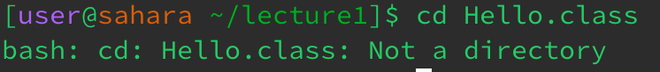

# CSE 15L - Lab 1
Example 1: cd, no argument

When I ran the cd command with no argument out of the home directory, nothing appeared to change. The directory stayed the same, and there was no output in the terminal.

Example 2: cd, directory argument

When I ran the cd command with a directory argument, the working directory changed to the directory I chose (lecture 1). 

Example 3: cd, file argument

When I ran the cd command with a file argument, I received a message in the terminal stating that the argument is "Not a directory". The working directory was not changed.

Example 4: ls, no argument

Example 5: ls, directory argument

Example 6: ls, file argument

Example 7: cat, no argument

Example 8: cat, directory argument

Example 9: cat, file argument

